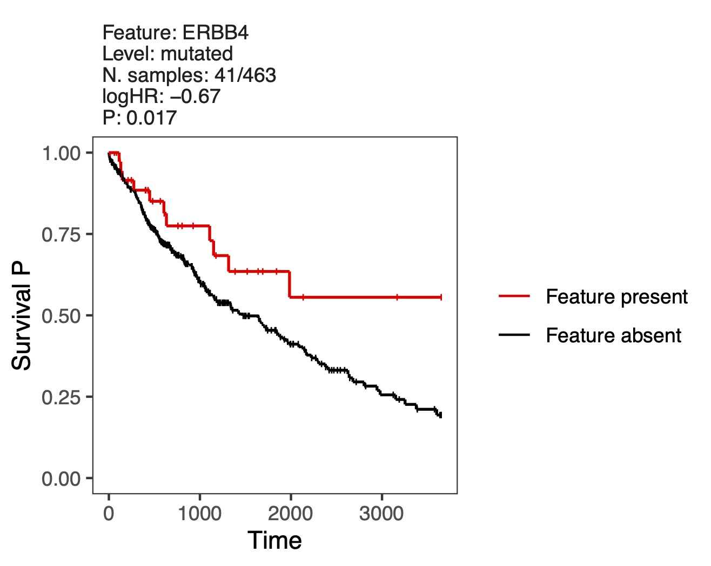
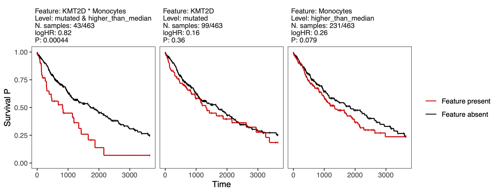

# PACIFIC - Predict and Analyze Combinations of Interacting Features In Cancer

This pipeline enables exploring the interactions of multi-omic features in relation to cancer patient outcomes. It employs feature selection techniques through generalized linear models to identify key associations. The model response can be continuous, binary, or survival outcomes. The model input features (predictors) can include numeric and categorical variables as well as their two-way interactions. The pipeline runs an iterative procedure consisting of subsampling, feature preprocessing and elastic net regularization of the multivariate models to identify the most frequently selected features across the iterations. These candidate features are a minimal subset of input features with robust explanatory information. The pipeline also provides a series of ANOVA P values which can be used for further refinement of the candidate features. This enables highlighting the features whose explanatory information is complementary to (user-defined) baseline variables, and complementary to the individual components of the interaction when an interaction feature is highlighted. 

## Installation
Dependencies: 
- `glmnet`
- `survival` (only for survival outcomes)

First clone the repository (`git clone https://github.com/reimandlab/PACIFIC.git`), then open R in the directory you cloned the package in and run `install.packages("PACIFIC", repos = NULL, type = "source")`.

## Usage in a glance
PACIFIC runs in two steps: 

* **Step 1:** The function `PACIFIC_step1()` runs the iterative procedure (subsampling, preprocessing, regularization) for a number of iterations (`num_iterations`) and stores the results in the output directory (`output_dir`). The user can independently repeat calling this function with the same input arguments (but with arbitrary `num_iterations`) to reach a desired **total** number of iterations. For instance, instead of running the function once with `num_iterations = 1000`, you can run it with `num_iterations = 10` for 100 times to accumulate 1000 iterations. This facilitates parallelizing the iterations, e.g. by submitting jobs to an HPC cluster. At any time, you can call `current_total_iters()` and specify the output directory to see the total number of iterations currently accumulated there. Note that usually more than 1000 iterations is needed for stable results (depending on the complexity of the input data).

* **Step 2:**  After completing the iterations in step 1, call `PACIFIC_step2()` and specify the directory where the iteration results are stored (`step1_output_dir`). This function outputs the candidate features, i.e. the ones selected by regularizations in more than a certain percentage of total iterations (determined by `EN_cutoff`), as well as the ANOVA P values. To include custom baseline variables for the ANOVA tests, specify them in `anova_baseline`.

## Example dataset
Read in the example dataset:
```R
fname_dataset <- system.file("extdata", "example_dataset.rds", package = "PACIFIC")
dataset <- readRDS(fname_dataset)

# class(dataset)
# "list"

# names(dataset)
# "data" "clinical_variables" "mutation_features" "immune_feature"
```
This is an R list containing a dataset of 463 TCGA-LUSC primary tumors annotated with overall survival outcomes, clinical variables, mutational status of cancer driver genes, and relative abundance of immune cell types in tumors (see IGX paper for data collection details). Let's view a portion of the features and the data table:
```R
dataset$clinical_variables
#1: "age"   "sex"   "stage"

head(dataset$mutation_features)
#1: "ABL1"   "ACVR1"  "ACVR1B" "ACVR2A" "AJUBA"  "AKT1"

head(dataset$immune_features)
#1: "B_cells_naive"              "B_cells_memory"
#3: "Plasma_cells"               "T_cells_CD8"
#5: "T_cells_CD4_naive"          "T_cells_CD4_memory_resting"

dataset$data[1:10, c("time", "status", 
                     dataset$clinical_variables, 
                     head(dataset$mutation_features, 3), 
                     head(dataset$immune_features, 3))]
#    time status   age    sex     stage        ABL1       ACVR1      ACVR1B B_cells_naive B_cells_memory Plasma_cells
#   <dbl>  <dbl> <dbl>  <fct>     <fct>       <fct>       <fct>       <fct>         <dbl>          <dbl>        <dbl>
#1:   371      1    67   MALE   Stage_I not_mutated not_mutated not_mutated   0.080421249     0.00000000   0.26404279
#2:   136      1    72   MALE   Stage_I not_mutated not_mutated not_mutated   0.044900022     0.01379474   0.10389209
#3:  2304      1    77 FEMALE   Stage_I not_mutated not_mutated not_mutated   0.061837118     0.00000000   0.01028084
#4:  3650      0    74   MALE   Stage_I not_mutated not_mutated     mutated   0.071255668     0.00000000   0.04098218
#5:   146      1    81   MALE  Stage_II not_mutated not_mutated not_mutated   0.072445522     0.00000000   0.07996814
#6:  3576      0    63 FEMALE Stage_III not_mutated not_mutated not_mutated   0.035232228     0.00000000   0.04845400
#7:   345      1    52   MALE   Stage_I not_mutated not_mutated not_mutated   0.002546043     0.01249645   0.03672128
#8:   716      1    73   MALE  Stage_IV not_mutated not_mutated not_mutated   0.153676877     0.00000000   0.03513933
#9:  2803      1    77   MALE   Stage_I not_mutated not_mutated not_mutated   0.076106437     0.00000000   0.03096591
#10:  973      1    83   MALE  Stage_II not_mutated not_mutated not_mutated   0.003390769     0.02346645   0.01971920
```

## Example run 1:
Here, we use PACIFIC to search for prognostic mutation features in the example dataset, without including any other control variable in the model. Run `PACIFIC_step1()` for 20 iterations:
```R
library(PACIFIC)

set.seed(1) # for reproducibility of this demo

PACIFIC_step1(data = dataset$data,
             response = "time",
             event = "status",
             single_features = dataset$mutation_features,
             num_iterations = 20,
             output_dir = "out")
```
Now run `PACIFIC_step2()`:
```R
results <- PACIFIC_step2(step1_output_dir = "out")
```
View the candidate features:
```R
results$features

#   feature level_of_first_variable level_of_second_variable EN_score P_ANOVA_of_feature P_ANOVA_of_feature_controlled_for_first_variable P_ANOVA_of_feature_controlled_for_second_variable P_ANOVA_of_feature_controlled_for_both_variables P_ANOVA_of_first_variable P_ANOVA_of_second_variable
#1:   ERBB4                 mutated                       NA       80         0.01654919                                               NA                                                NA                                               NA                        NA                         NA
#2:     APC                 mutated                       NA       70         0.03917444                                               NA                                                NA                                               NA                        NA                         NA
```

The top candidate is "ERBB4" mutation. View the KM plot of this feature:
```R
# options(repr.plot.width = 4.4, repr.plot.height = 3.5)
results$km_plots[["ERBB4"]]
```


## Example run 2:
Let's see the more complex aspects of PACIFIC. Here, using the example dataset, we are interested in finding prognostic interactions between mutation and immune features while controlling for the effect of baseline clinical variables. This problem is formulated in the IGX paper based on the following design choices:
* Assign clinical variables to `single_features`.
* Assign all two-way combinations of mutation and immune features to `interaction_features`.
* Work with median-dichotomized (higher or lower than median) values of immune features (rather than their numeric values). Therefore, assign immune features to `features_to_discretize`. Use default `discretization_method = "median"`.
* As both of the high/low states are plausible for the immune features, let the pipeline determine the optimum levels for each immune feature in the potential interactions with mutation features. Therefore, assign the immune features to `features_with_flexible_direction`.
* Mutation features are factors with "not_mutated" as first level which is by default fixed to their reference level.
* Avoid prefiltering of the clinical variables inside the iterations to make sure that their effects are controlled for in all regularized CoxPH models. Therefore, assign clinical features to both `features_to_skip_sparsity_prefiltering` and `features_to_skip_survival_prefiltering`.
  
Run `PACIFIC_step1()` with the above parameters for 3 iterations, and repeat the call for 5 times, yielding in a total of 15 iterations all stored in a specified `output_dir`. Note that usually more than 1000 iterations is needed for stable results (i.e. reproducible `EN_score` obtained in step 2), depending on the complexity of the input data.
```R
library(PACIFIC)

set.seed(1) # for reproducibility of this demo

for(i in 1:5){
    PACIFIC_step1(data = dataset$data,
                  response = "time",
                  event = "status",
                  single_features = dataset$clinical_variables,
		  interaction_features = list(dataset$mutation_features,
                                              dataset$immune_features),
		  features_to_discretize = dataset$immune_features,
		  features_with_flexible_direction = dataset$immune_features,
		  features_to_skip_sparsity_prefiltering = dataset$clinical_variables,
		  features_to_skip_univariate_association_prefiltering = dataset$clinical_variables,
		  num_iterations = 3, 
		  output_dir = "out", 
		  verbose = TRUE)
}

# ----------------------------------------------------
# call PACIFIC_step1:
# preprocessing ... 14.18098 secs 
# iteration 1/3 : 27 features selected by Elastic net. 2.674277 secs 
# iteration 2/3 : No feature selected by Elastic net. 2.800196 secs 
# iteration 3/3 : 12 features selected by Elastic net. 3.109186 secs 
# save the results in: path/to/out
# elapsed time: 22.78648 secs 
# ----------------------------------------------------
# call PACIFIC_step1:
# preprocessing ... 18.95363 secs 
# iteration 1/3 : 24 features selected by Elastic net. 2.926076 secs 
# iteration 2/3 : No feature selected by Elastic net. 2.509057 secs 
# iteration 3/3 : 13 features selected by Elastic net. 2.941139 secs 
# save the results in: path/to/out
# elapsed time: 27.35026 secs 
# ----------------------------------------------------
# call PACIFIC_step1:
# preprocessing ... 18.68423 secs 
# iteration 1/3 : 34 features selected by Elastic net. 2.991087 secs 
# iteration 2/3 : 28 features selected by Elastic net. 2.560865 secs 
# iteration 3/3 : 6 features selected by Elastic net. 2.729803 secs 
# save the results in: path/to/out
# elapsed time: 26.98579 secs 
# ----------------------------------------------------
# call PACIFIC_step1:
# preprocessing ... 19.10262 secs 
# iteration 1/3 : 33 features selected by Elastic net. 2.649518 secs 
# iteration 2/3 : 28 features selected by Elastic net. 2.678333 secs 
# iteration 3/3 : 28 features selected by Elastic net. 3.125965 secs 
# save the results in: path/to/out
# elapsed time: 27.57621 secs 
# ----------------------------------------------------
# call PACIFIC_step1:
# preprocessing ... 21.04174 secs 
# iteration 1/3 : 35 features selected by Elastic net. 3.067441 secs 
# iteration 2/3 : 27 features selected by Elastic net. 2.744998 secs 
# iteration 3/3 : 24 features selected by Elastic net. 2.726398 secs 
# save the results in: path/to/out
# elapsed time: 29.6028 secs 
```
```R
current_total_iters(dir = "out")

# Total iterations currently accumulated in "out" = 15
```
Now run `PACIFIC_step2()` with assigning the clinical features to the baseline variables for ANOVA tests:
```R
results <- PACIFIC_step2(step1_output_dir = 'out',
                         anova_baseline = dataset$clinical_variables)
```
View the candidate features:
```R
results$features

#                       feature level_of_first_variable      level_of_second_variable EN_score P_ANOVA_of_feature P_ANOVA_of_feature_controlled_for_first_variable P_ANOVA_of_feature_controlled_for_second_variable P_ANOVA_of_feature_controlled_for_both_variables P_ANOVA_of_first_variable P_ANOVA_of_second_variable
#1:             KMT2D*Monocytes                 mutated            higher_than_median 86.66667       0.0004387153                                     0.0002226526                                       0.001773958                                      0.001535063                 0.3606967                 0.07902884
#2:                       stage               Stage_III                          <NA> 73.33333       0.0119315703                                               NA                                                NA                                               NA                        NA                         NA
#3:                       stage                Stage_IV                          <NA> 73.33333       0.0250951328                                               NA                                                NA                                               NA                        NA                         NA
#4: DMD*Dendritic_cells_resting                 mutated lower_than_or_equal_to_median 73.33333       0.0038387733                                     0.0107382147                                       0.004068671                                      0.012164414                 0.1582959                 0.69080775
#5:          CDKN2A*T_cells_CD8                 mutated lower_than_or_equal_to_median 60.00000       0.0659434636                                     0.1744545811                                       0.096514456                                      0.295044751                 0.2137792                 0.36907611
#6:              TP53*Monocytes                 mutated lower_than_or_equal_to_median 60.00000       0.0103065474                                     0.0337056835                                       0.047693554                                      0.121954591                 0.1398141                 0.07902884
#7:    KMT2D*Mast_cells_resting                 mutated            higher_than_median 60.00000       0.0672526071                                     0.1082488038                                       0.033816773                                      0.037360851                 0.3606967                 0.53182877
```
The top candidate is "KMT2D*Monocytes" which is an "interaction feature". View the KM plots of this feature and the individual components of the interaction:
```R
# options(repr.plot.width = 9, repr.plot.height = 3.5)
results$km_plots[["KMT2D*Monocytes"]]
```



## Arguments 
#### `PACIFIC_step1()`
* `data`: A data.frame (or an extension of data.frame, e.g. data.table). The table of input data with rows for samples and columns for features and variables.
* `response`: Name of the column in `data` which contains the response values.
* `event`: Name of the column in `data` which contains the event status values for survival outcomes. This column must contain only 0 and 1. Default is `NA`.
* `single_features`: (*for input features*) Vector of "single features". Default is `NA` (for no single feature).
* `interaction_features`: (*for input features*) Explicit or list-based specification of "interaction features". Explicit: a vector of the form `c("A*B", "C*D", ...)`. List-based: list of two vectors of single components for all two-way combinations as interaction features. Default is `NA` (for no interaction feature). Note that `single_features` cannot overlap with any component in `interaction_features`.
* `features_to_discretize`: The subset of input features (being single or component of interaction) to be discretized, i.e. to be converted from numeric to categorical (subject to `discretization_method`). Default is `NA` (for no such feature).
* `discretization_method`: The method for discretization. Either `"median"` (for median dichotomization), or a `function` designed to get a numeric vector as input and return a factor vector (of the same length) as output. Default is `"median"`.
* `features_with_flexible_direction`: The subset of input features (being single or component of interaction) to be allowed to have flexible direction. Applicable only to either factor variables, or numeric variables in `features_to_discretize`. This means that the *reference level* of these variables are to be determined by the pipeline in order to optimize the associations with survival. Default is `NA` (for no such feature).
* `features_to_skip_sparsity_prefiltering`: The subset of input features (being single only) to be skipped for prefiltering by sparsity (within iterations). Default is `NA` (for no such feature).
* `features_to_skip_survival_prefiltering`: The subset of input features (being single only) to be skipped for prefiltering by weak survival association (within iterations) . Default is `NA` (for no such feature).
* `sparsity_criterion`: The criterion used for detecting sparse features in prefiltering by sparsity (within iterations). Applicable to features which involve factor(s). It should be a string of the form `"X_percent"` or `"X_absolute"` (where `X` is a number), meaning that the cutoff for the minimum size of the feature is either `X` percent of the size of the input data (within the iteration) or is just `X`, respectively. Default is `"5_percent"`.
* `wald_p_cutoff`: Cutoff for the Wald P values of univariate CoxPH models used for prefiltering by weak survival association. Default is `0.1`.
* `subsampling_ratio`: The ratio used for subsampling `data` to make the input data for each iteration. Note that the ratio of events (% samples with status=1) in `data` is maintained in the subsamplings. Default is `0.8`.
* `num_iterations`: Number of iterations to run. Default is `10`.
* `output_dir`: The directory to store the results of iterations.
* `verbose`: whether to print progress messages. Default is `FALSE`.

#### `PACIFIC_step2()`
* `step1_output_dir`: The directory where the iteration results (in step 1) are stored.
* `EN_cutoff`: Cutoff for candidate features (based on percentage of the total iterations). Default is `50`.
* `anova_baseline`: The baseline variables used for ANOVA tests. Default is `NA` (for no baseline variable).
* `plot_km`: Whether to generate KM plots of candidate features. Default is `FALSE`.

#### Notes
- The default reference level of a factor feature is its first level and this remains fixed throughout the pipeline, unless the it is assigned to "features_with_flexible_direction".
- If a feature is of type `character`, the pipeline automatically converts it to factor by the function `factor()`. If a specific (fixed) reference level for a feature is expected, the user must already set it to factor with the desired reference level (in the input data).
- Note that when no feature is assigned to baseline variables for ANOVA (i.e. `anova_baseline = NA`), the "P_ANOVA_of_feature", "P_ANOVA_of_first_variable", and "P_ANOVA_of_second_variable" are equivalent to P value of the univariate coxph model corresponding to the feature/variable (likelihood ratio test).
