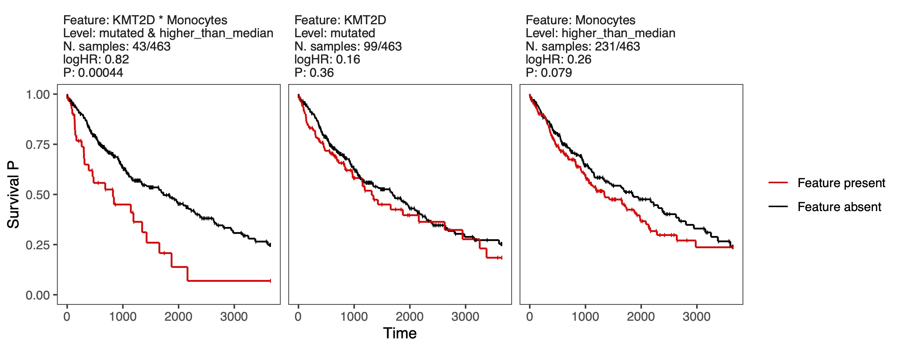

# PACIFIC - Predict and Analyze Combinations of Interacting Features In Cancer

This pipeline enables exploring the interactions between two types of multi-omic features in relation to cancer patient outcomes. The pipeline runs an iterative procedure consisting of subsampling, feature preprocessing and elastic net regularization of the multivariate models to identify the most frequently selected interactions across the iterations. These candidate interactions are a minimal subset of input interactions with robust explanatory information. Additionally, the pipeline outputs a series of ANOVA p-values to highlight the significant interactions, controlling for main effects and baseline covariates.

## Installation
Dependencies: 
- `glmnet`
- `survival`
- `ggplot2`

Clone the repository, then run the following command in R: `install.packages("path/to/PACIFIC", repos = NULL, type = "source")`.

## Usage
In this example, PACIFIC is applied to a dataset of 463 TCGA-LUSC primary tumors annotated with clinical variables, mutational status of cancer driver genes, and relative abundance of immune cell types in tumors (see IGX paper for data collection details). Here, we define the patient outcome of interest as **overall survival**, the first feature set (`feat1`) as the mutational status of driver genes, the second feature set (`feat2`) as the immune cell levels, and the `baseline` variables as patient age, sex, and tumor stage. For simplicity, we use a small portion of the available feature sets in this example.

```R
library(PACIFIC)

####
# Using the dataset included in the PACIFIC package. 
####

fname_data <- system.file("extdata", "example_dataset.rds", package = "PACIFIC")
data <- readRDS(fname_data)

####
# Define the baseline and the two sets of features.
####

baseline <- c("age", "sex", "stage")
feat1 <- c("TP53", "KMT2D", "CDKN2A", "KRAS")
feat2 <- c("B_cells_memory", "Plasma_cells", 
           "Macrophages_M1", "Macrophages_M2", 
           "Monocytes", "NK_cells_activated", 
           "T_cells_CD8","T_cells_regulatory_Tregs")

####
# View a few rows of the data with the selected columns:
####

data[1:5 , c("time", "status", baseline, feat1, feat2)]

#   time status age    sex    stage    TP53       KMT2D      CDKN2A        KRAS
#1:  371      1  67   MALE  Stage_I mutated not_mutated not_mutated not_mutated
#2:  136      1  72   MALE  Stage_I mutated     mutated     mutated not_mutated
#3: 2304      1  77 FEMALE  Stage_I mutated not_mutated not_mutated not_mutated
#4: 3650      0  74   MALE  Stage_I mutated not_mutated not_mutated not_mutated
#5:  146      1  81   MALE Stage_II mutated     mutated not_mutated not_mutated
#   B_cells_memory Plasma_cells Macrophages_M1 Macrophages_M2   Monocytes
#1:     0.00000000   0.26404279     0.09956779      0.1293732 0.038421812
#2:     0.01379474   0.10389209     0.03997567      0.2588654 0.028434340
#3:     0.00000000   0.01028084     0.05054219      0.3876288 0.003981384
#4:     0.00000000   0.04098218     0.09988443      0.4618061 0.000000000
#5:     0.00000000   0.07996814     0.10241677      0.1191702 0.021436310
#   NK_cells_activated T_cells_CD8 T_cells_regulatory_Tregs
#1:        0.000000000  0.10903708              0.003766431
#2:        0.000000000  0.17287965              0.046420556
#3:        0.001416327  0.07765524              0.000000000
#4:        0.003790870  0.03094862              0.000000000
#5:        0.036007745  0.17967422              0.040558222
```

PACIFIC pipeline runs in two steps:
- **Step 1**: To run the iterative procedure. This step can be repeated through independent calls to accumulate the desired **total** number of iterations in a specified output directory, enabling parallel runs. See the **'Scalability'** section for more information.
- **Step 2**: To aggregate the resutls of all iterations accumulated in the output directory. At this step, the candidate interactions (those selected in ≥50% of iterations) are identified, and their ANOVA p-values are calculated. The 50% cutoff can be adjusted by the user.

```R
####
# Apply PACIFIC to the data with the defined features (using default settings).
####

set.seed(1) # for reproducibility of this demo

PACIFIC_survival_step1(data = data,
                       baseline = baseline,
                       feat1 = feat1,
                       feat2 = feat2,
                       num_iterations = 10,
                       output_dir = 'out')
# ----------------------------------------------------
# PACIFIC step 1:
# preprocessing ... 0.406163 secs 
# iteration 1/10 : 11 features selected by Elastic net. 0.2405679 secs 
# iteration 2/10 : 8 features selected by Elastic net. 0.2378569 secs 
# iteration 3/10 : 1 features selected by Elastic net. 0.267096 secs 
# iteration 4/10 : 10 features selected by Elastic net. 0.236763 secs 
# iteration 5/10 : 13 features selected by Elastic net. 0.225141 secs 
# iteration 6/10 : 16 features selected by Elastic net. 0.4042552 secs 
# iteration 7/10 : 14 features selected by Elastic net. 0.2572432 secs 
# iteration 8/10 : 13 features selected by Elastic net. 0.224154 secs 
# iteration 9/10 : 4 features selected by Elastic net. 0.2320871 secs 
# iteration 10/10 : 12 features selected by Elastic net. 0.2292762 secs 
# saving the results ... 0.0007610321 secs 
# total elapsed time: 2.962891 secs 

results <- PACIFIC_survival_step2(step1_output_dir = 'out',
                                  anova_baseline = baseline)
# ----------------------------------------------------
# PACIFIC step 2:
# elapsed time: 0.601191 secs 
```

The returned `results` is saved in .RDS format in `output_dir`. View the top interactions (frequently selected in the iterations) in the `$top_interactions` facet of `results`:
```R
results$top_interactions

#                 intr feat1_level                   feat2_level EN_score
#1:    KMT2D*Monocytes     mutated            higher_than_median      100
#2: CDKN2A*T_cells_CD8     mutated lower_than_or_equal_to_median       80
#3:     TP53*Monocytes     mutated lower_than_or_equal_to_median       60
#         intr_P    intr_P_C1   intr_P_C2   intr_P_C3   feat1_P    feat2_P
#1: 0.0004387153 0.0002226526 0.001773958 0.001535063 0.3606967 0.07902884
#2: 0.0659434636 0.1744545811 0.096514456 0.295044751 0.2137792 0.36907611
#3: 0.0103065474 0.0337056835 0.047693554 0.121954591 0.1398141 0.07902884
#   intr_logHR intr_logHR_lower95 intr_logHR_upper95 feat1_logHR
#1:  0.8232534         0.40706933         1.23943739   0.1575879
#2:  0.4981860        -0.00184557         0.99821767   0.2442130
#3: -0.3784980        -0.67170399        -0.08529202  -0.2483703
#   feat1_logHR_lower95 feat1_logHR_upper95 feat2_logHR feat2_logHR_lower95
#1:          -0.1754631          0.49063898   0.2555551         -0.03018218
#2:          -0.1311699          0.61959601   0.1291237         -0.15292406
#3:          -0.5713498          0.07460914  -0.2555551         -0.54129234
#   feat2_logHR_upper95
#1:          0.54129234
#2:          0.41117153
#3:          0.03018218
```

The KM plots for the top interactions are stored in a named list in the `$km_plot_list` facet of `results`. View the KM plots for the "KMT2D*Monocytes" interaction:
```R
plot(results$km_plot_list[['KMT2D*Monocytes']])
```


### Notes
- We recommend highlighting only the interactions for which all of the following ANOVA tests are significant after FDR correction (available in `results$top_interactions`):
   - `intr_P`: interaction *vs.* baseline
   - `intr_P_C1`: interaction *vs.* baseline + feat1
   - `intr_P_C2`: interaction *vs.* baseline + feat2
   - `intr_P_C3`: interaction *vs.* baseline + feat1 + feat2
- By default, each feature in `feat1` and `feat2` is treated according to the following rules:
   - If it is categorical, it must be `factor` with two levels. In this case, the second level is considered as the "active" state. In other words, only the second level may contribute to any potential interaction.
   - If it is continuous (`numeric`), it is converted into high or low levels (within each iteration of feature selection) based on `> median` or `<= median`, respectively. In this case, both high and low levels may contribute to any potential interaction.
- Usually more than 1000 iterations are needed for stable results (depending on the complexity of the input data).

## Scalability
You can **repeat** the **Step 1** of PACIFIC through independent calls of the function to accumulate the desired total number of iterations **in the same output directory**. To do so, please note the following:
- Each call of **Step 1** must be given a unique `job_id` argument. Any call that reuses a previously used job index for the given output directory is prevented with an error message.
- Other than `job_id`, `num_iterations`, and `verbose`, all arguments to the **Step 1** call must remain consistent across the repeated calls. Any inconsistent call for the given output directory is prevented with an error message.
- Once the desired total number of iterations has been reached, the **Step 2** function should be called for the given output directory to aggregate the iterations and produce the final results.
#### Local parallelism via `mclapply()`
```R
####
# Using the setting of the basic example abobe. 
####

fname_data <- system.file("extdata", "example_dataset.rds", package = "PACIFIC")
data <- readRDS(fname_data)
baseline <- c("age", "sex", "stage")
feat1 <- c("TP53", "KMT2D", "CDKN2A", "KRAS")
feat2 <- c("B_cells_memory", "Plasma_cells", 
           "Macrophages_M1", "Macrophages_M2", 
           "Monocytes", "NK_cells_activated", 
           "T_cells_CD8","T_cells_regulatory_Tregs")

####
# Run step1 for 10 times using 5 parallel cores
####

library(parallel)

ncores <- 5
stopifnot(ncores <= detectCores())

status <- mclapply(1:10, function(job_id){
    PACIFIC_survival_step1(data = data,
                           baseline = baseline,
                           feat1 = feat1,
                           feat2 = feat2,
                           num_iterations = 10,
                           output_dir = 'out',
                           job_id = job_id)
}, mc.cores = ncores)

if(!all(status == 0)) message('All tasks completed successfully!')

####
# If any individual task raises an error, it can be inspected via the `status` list.
####
```
 
